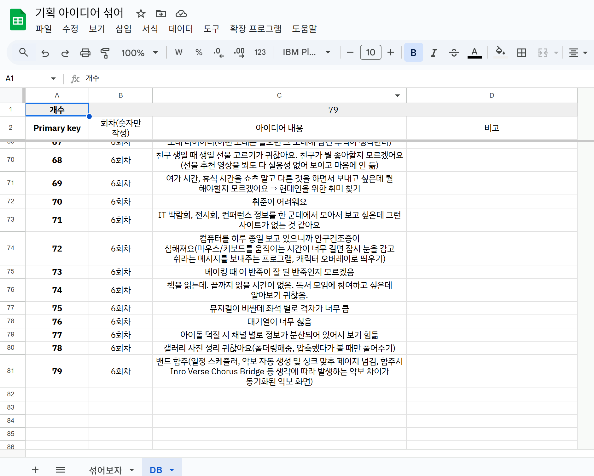
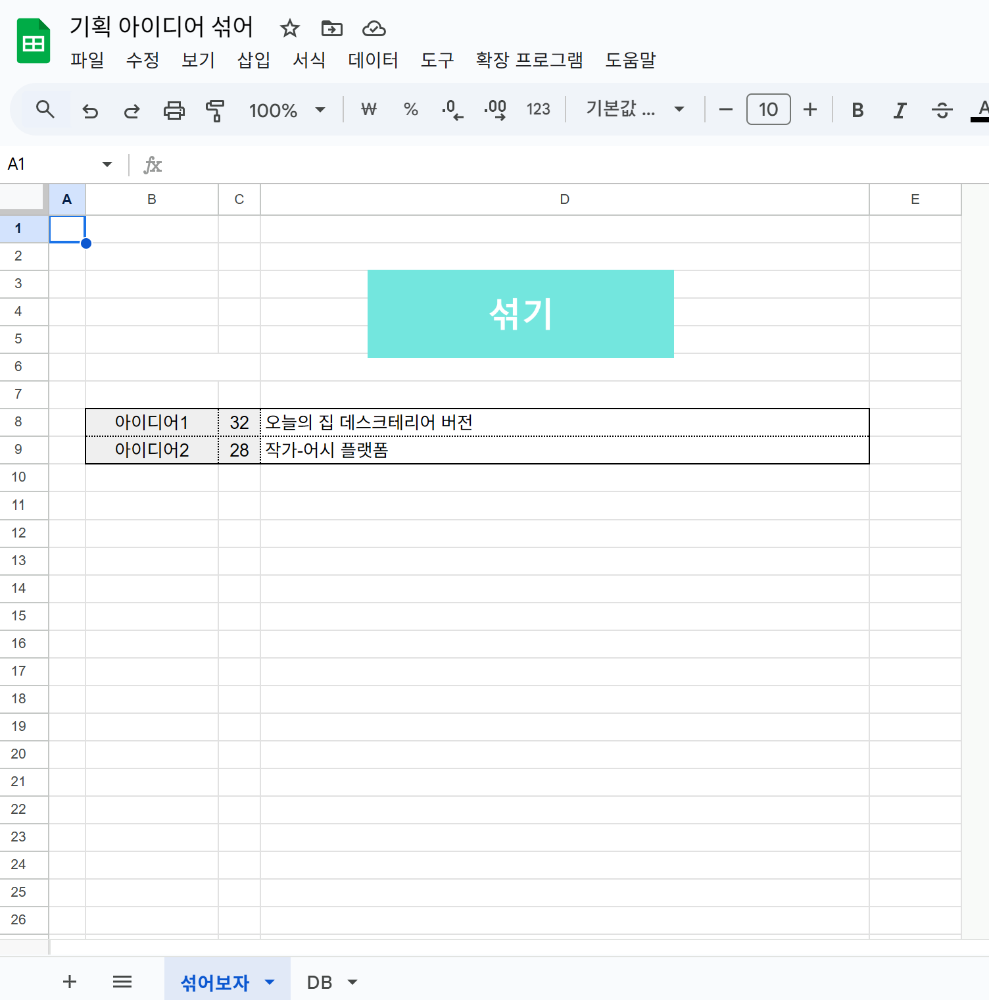
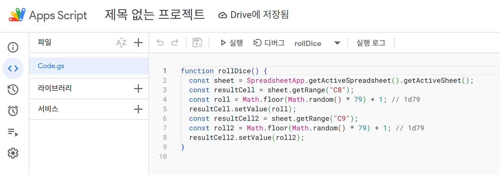

# 250422 한 일

- 기획 회의 진행
  -> 아이디어 고정
- 결정한 아이디어의 실현 가능 여부 검토
- 아이디어 구체화 진행

## 기획 회의 진행 (아이디어 고정)

- 지난 아이디어를 두 개씩 뽑아서 섞을 수 있는 스프레드 시트 제작

  
  
  

  - 이 스프레드 시트로 아이디어를 합쳐보면서 진행해보다가 새로운 아이디어를 제시함
  - 새롭게 제시된 아이디어는 밴드 합주를 위한 올인원 협업 앱
  - 핵심 기능이 분명하다는 점을 장점으로 하여 개발할 프로젝트로 선정함

## 결정한 아이디어의 실현 가능 여부 검토

- 불안 요소를 생각해 봄
  - AI 채보 자체가 안 된다면 프로젝트가 무너질 수 있다는 우려 및 AI를 담당한 팀원이 과중할 수 있다는 우려 존재
    - 오디오를 추출하고, 세션 분리, 채보용 변환, 악보용 포맷 변환, 웹 악보 렌더링 라이브러리의 존재를 확인함
      - http://sound-of-pixels.csail.mit.edu/ 등
    - 우선 구현 가능할 것으로 전망
  - 합주 시 초저지연을 실현할 수 있는지 우려함
    - 웹 소켓으로 동시 접속 고려
    - 우선 합주 속도를 인식하지 말고 노래 속도에 맞게 다음 장으로 악보가 자동으로 넘어가는 정도를 생각함
  - 가상악기를 구현함에 있어 악기 소스가 존재하는지에 대한 우려
    - 소스는 찾아보면 존재했음

* 찾아 보는 과정에서 악보 편집에 대한 수요가 발견되었는데, 구현할 수 있을지 새로 우려가 제기됨

* 악보를 자동으로 만들어주는 것은 없어도, 악보를 등록하여 재생 버튼을 누르면 그 순서대로 보여주는 웹서비스의 존재는 확인함
  - https://feat.band/

## 아이디어 구체화 진행

- 합주 사용자들의 상황을 생각했을 때, 태블릿으로 악보를 확인하며 연주하는 사람들이 많았음
- 이에 따라 태블릿으로 서비스를 사용한다는 것을 기본 전제로 웹으로 구현하는 것이 타당한지, 앱으로 구현하는 것이 타당한지를 검토함
- 보통 같은 조건이면 네이티브 앱이 빠르다는 판단. 앱으로 하면 편할 것 같다는 의견이 우세.
- 라이브러리의 사용 및 악보 편집 과정에서는 웹이 편할 것 같다는 의견도 존재.
- 어느 방향으로 구현할지는 내일 더 이야기해보고 정하기로 함
