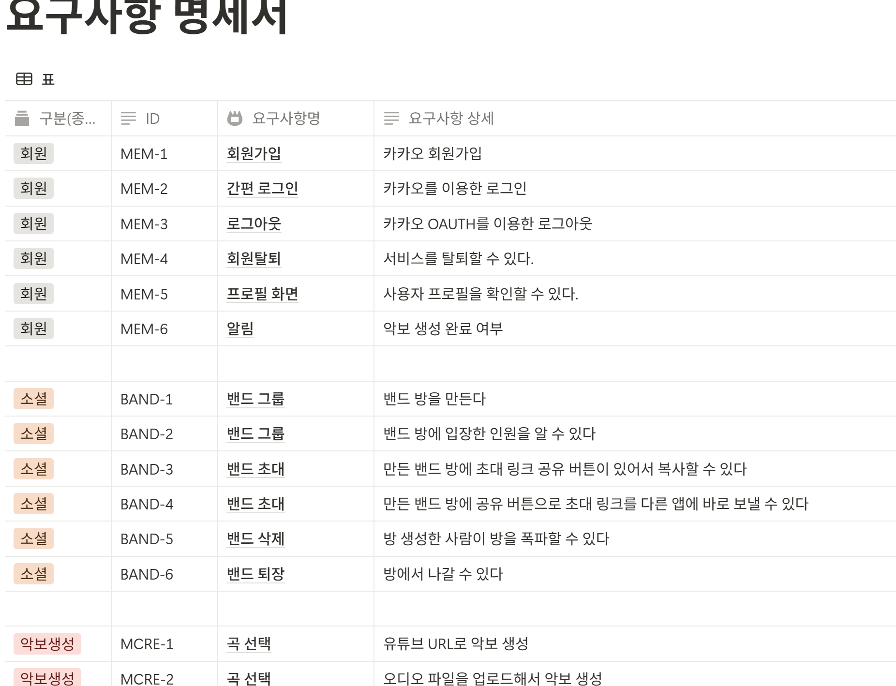
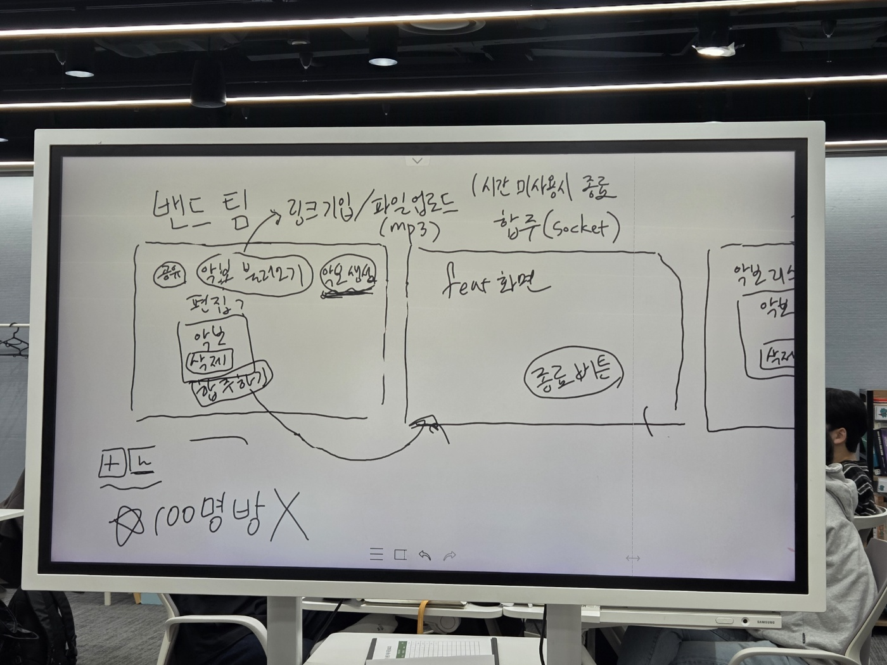
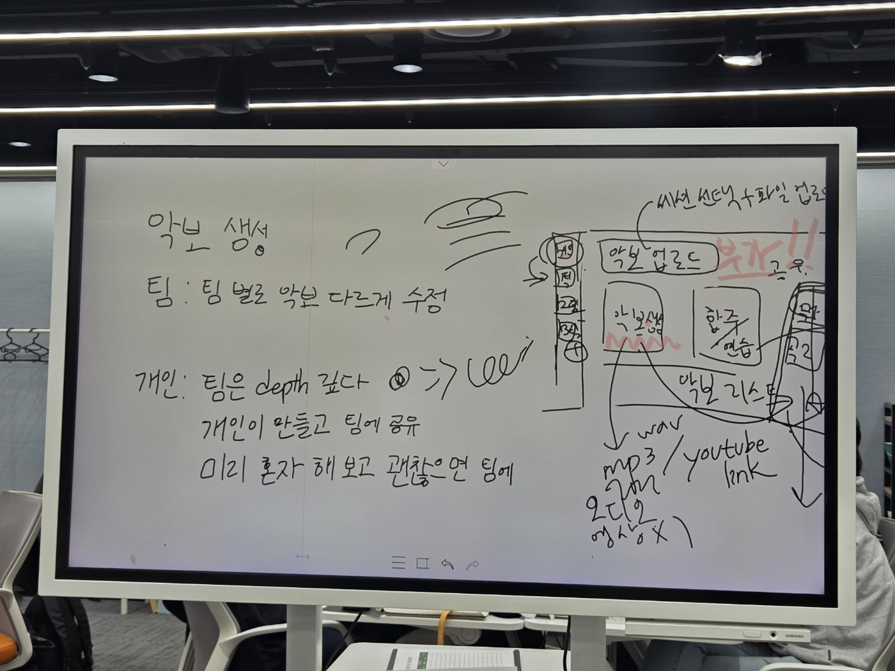
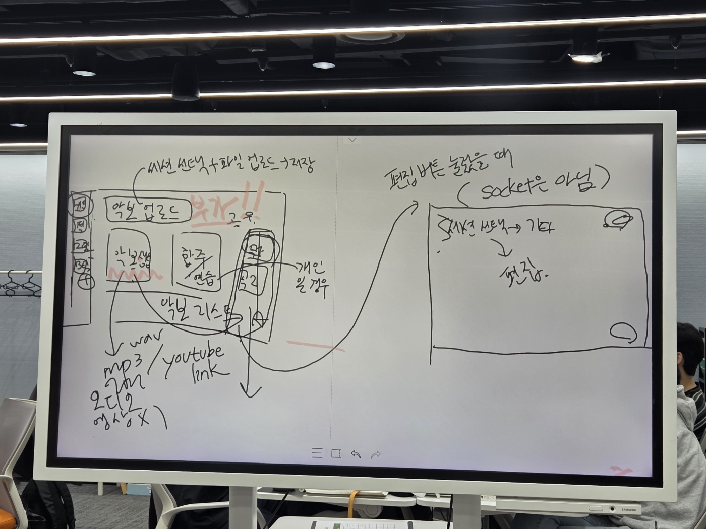
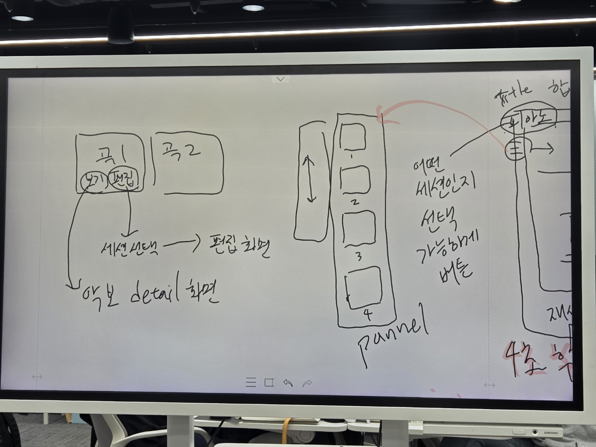
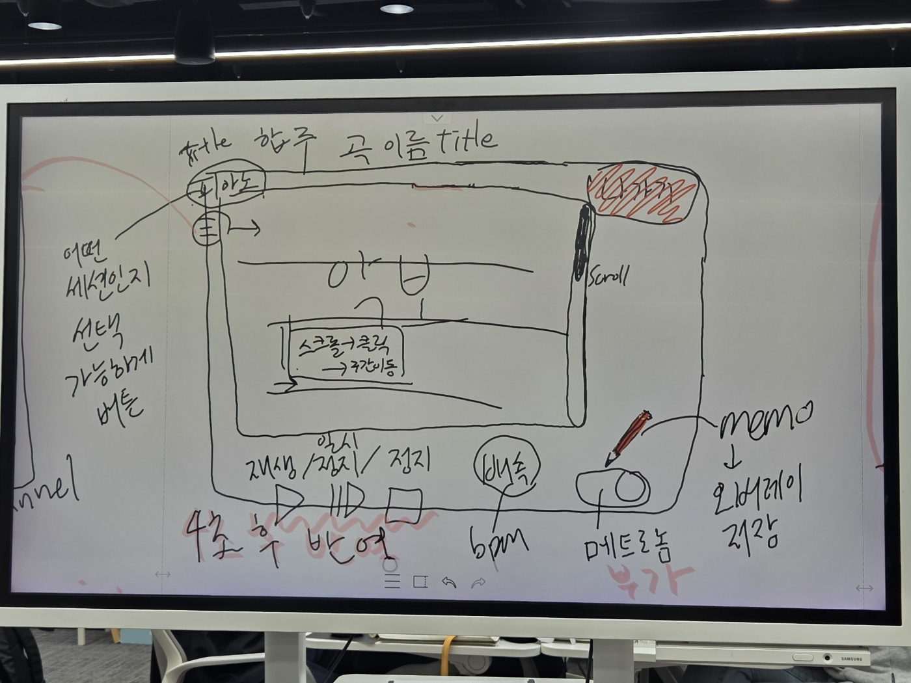
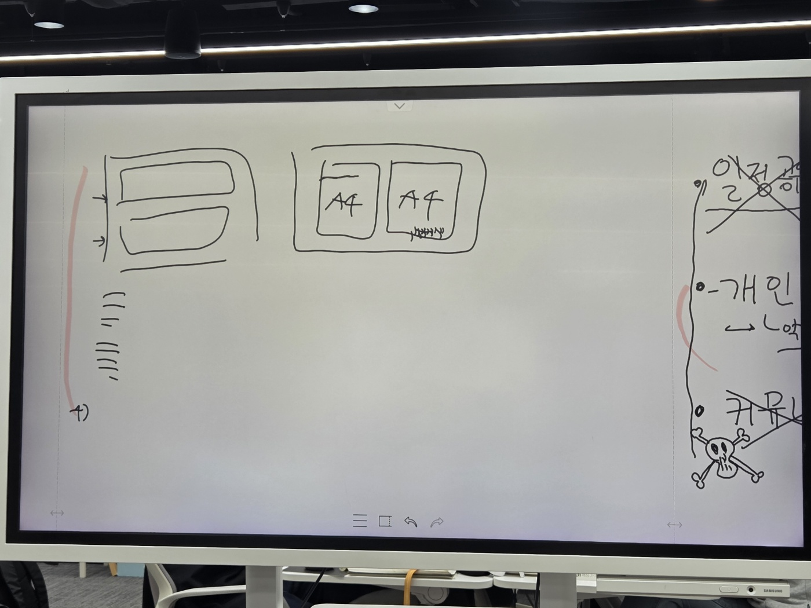
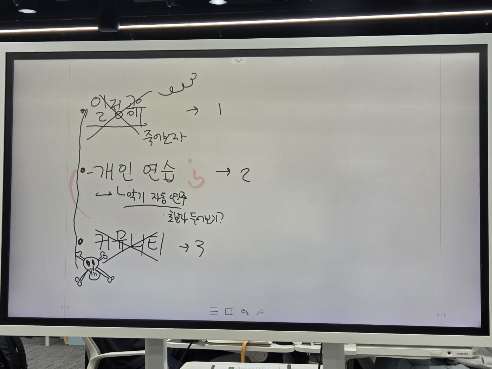
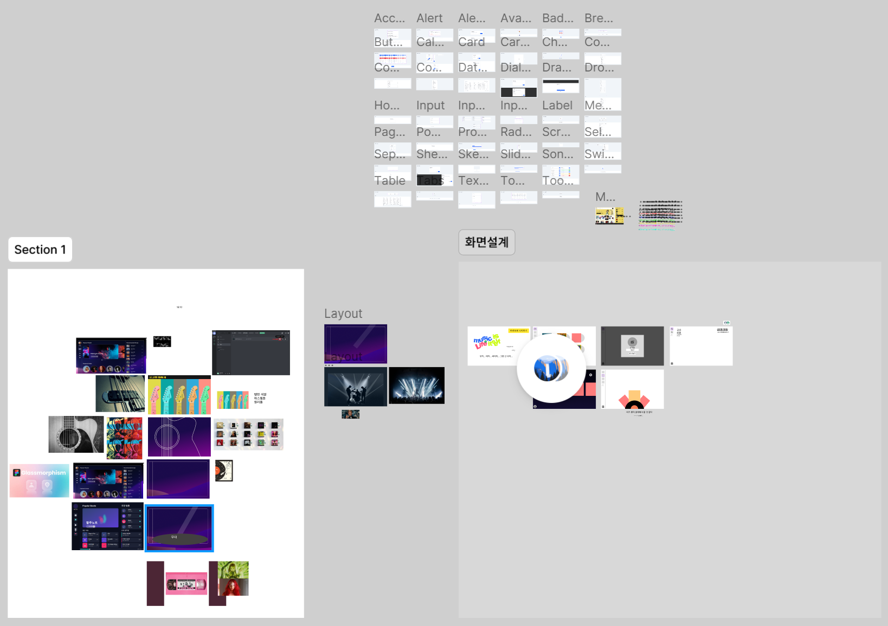

# 250423 한 일

- 요구사항 명세서 작성
- 화면에 들어가야 할 내용 논의 및 생각하는 내용 통일
- Figma 화면 설계 진행(미완료했지만, 시도함)

## 요구사항 명세서 작성

- 다 함께 틀을 토대로 요구사항 명세서 작성 진행
- 클라이언트가 요구한다는 전제하에 요구사항 위주로 작성, 추후 API 명세서 따로 작성 예정

## 화면에 들어가야 할 내용 논의 및 생각하는 내용 통일

- 요구사항 명세서를 작성하다 보니 각자 생각하고 있는 바가 다르다는 느낌을 받음
- 이에 따라 1시부터 2시간 동안 전자 보드를 이용하여 함께 들어가야 할 사항들을 그려 보면서 생각하는 내용을 통일하는 과정을 진행함

- 아래와 같이 구성을 그려보았고, 의견을 통일하여 요구사항 명세서의 작성을 완료함
- 큰 기능은 밴드 그룹 생성, 악보 자동 생성, 그룹 내에서 악보를 재생하면 접속한 사람들이 보고 있는 악보가 싱크가 맞는 채로 자동 재생되는 것으로 결정

  
  
  
  
  
  
  
  

## Figma 화면 설계 진행(미완료했지만, 시도함)

- 화면을 설계하기에 앞서 컨셉을 잡아보기로 논의
- 팝아트, 밴드, 파스텔톤 컬러, 무대 조명 등의 이미지를 찾아보면서 Figma 및 mattermost로 레퍼런스 수집
- 참고할 만한 UI를 codepen 등에서 검색하여 화면 설계를 진행
- 아직 서비스 명이 정의되지 않아 악곡 리스트가 돋보이도록 어두운 바탕으로 디자인하면 좋을지도 모른다는 의견 정도만 내놓고, 결정을 완료하지는 못함
- 내일 마저 Figma 진행 예정

  
