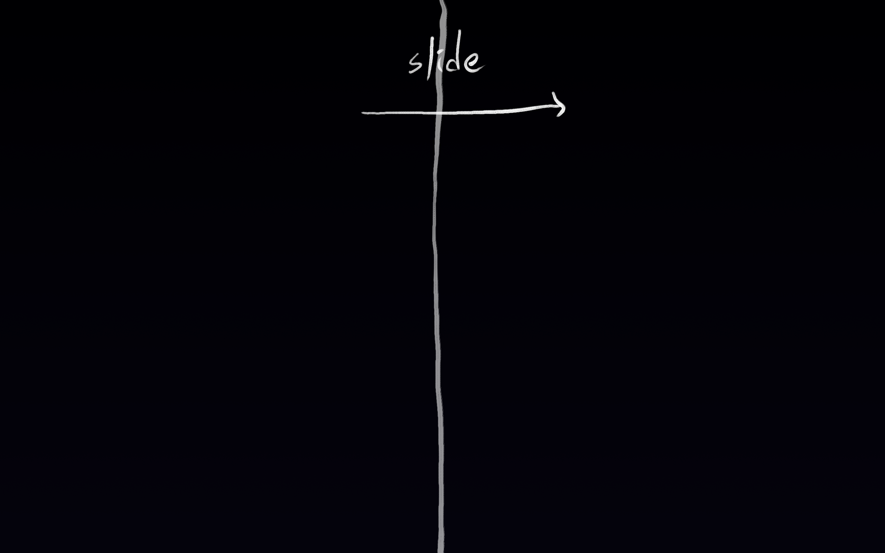
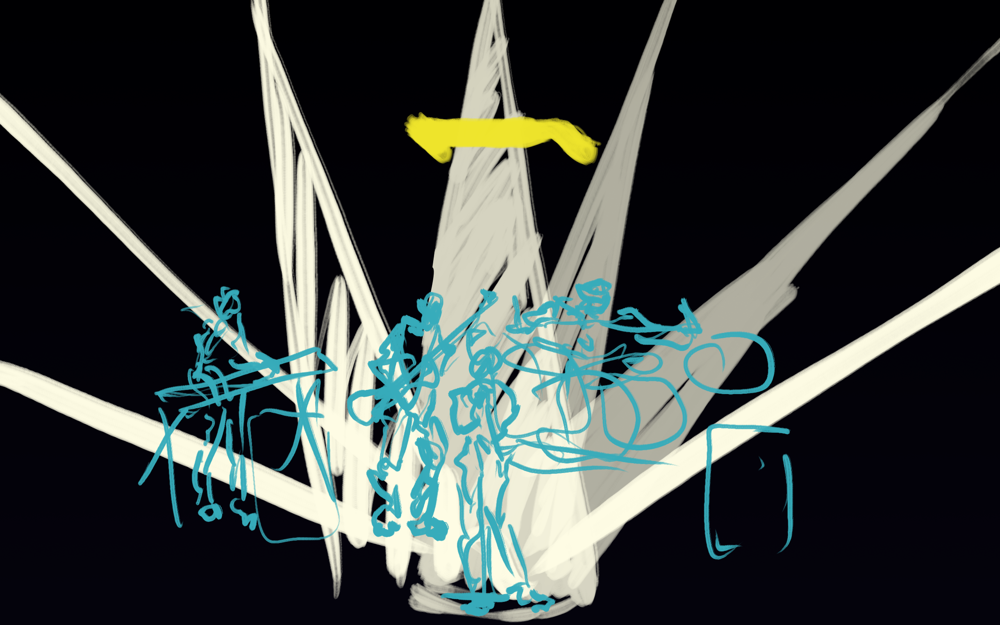
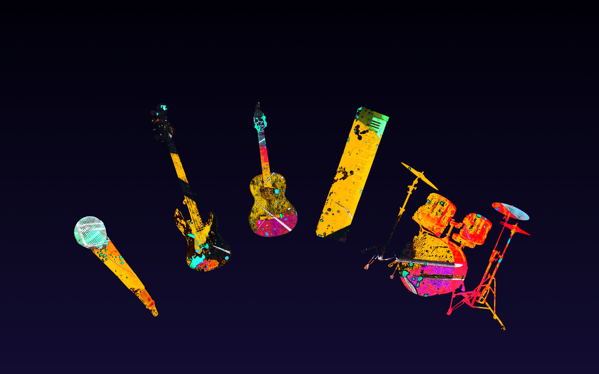
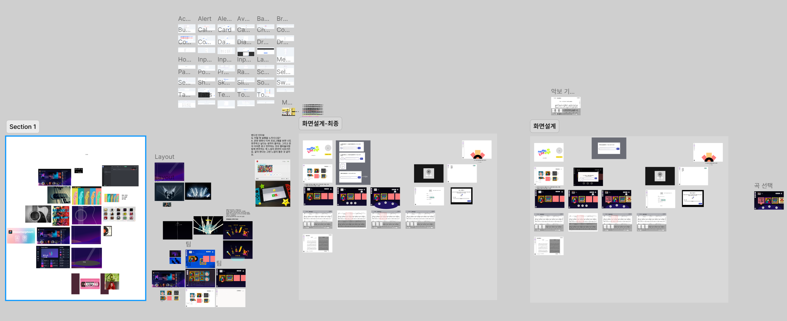
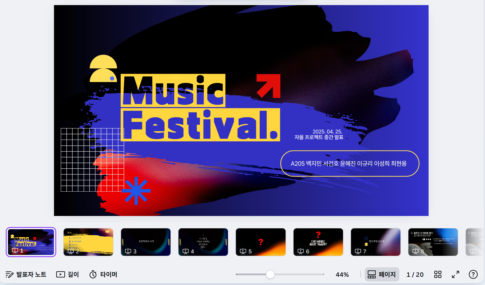
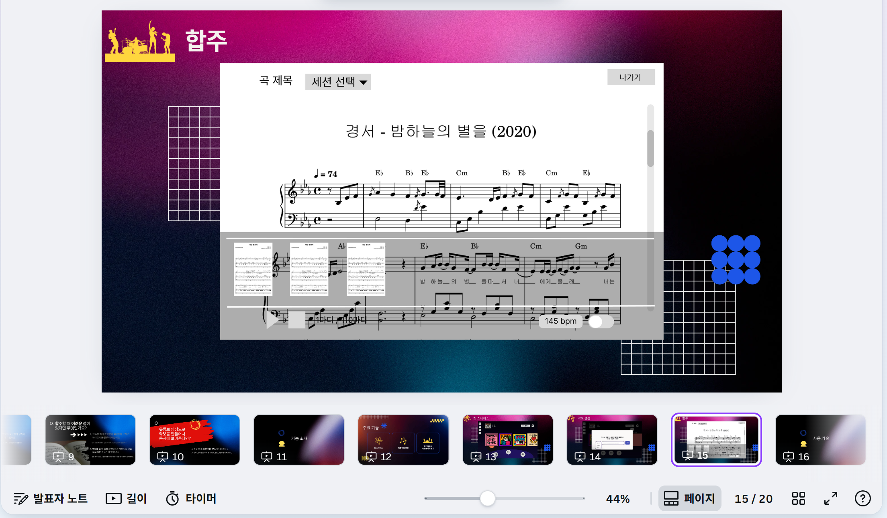

# 250424 한 일

- UI/UX 디자인 구상
- 발표 장표 제작

## UI/UX 디자인 구상

- 어떤 디자인으로 UI/UX 구성 작업을 하면 좋을지 컨셉 잡기 진행
- 서비스 명이 아직 제대로 정해지지 않아 컨셉을 정하기 어려웠지만, 팝아트 계통으로 레퍼런스를 많이 찾음
- 가독성 측면에서 고민이 들어서 기존의 music 서비스를 많이 참고해서 진행해볼까도 고민

  
  
  

  ㄴ보정이 심해서 좀 줄여서 세션 선택 화면 구현을 진행할지 고민해봄. 가독성을 위해서는 단순히 악기 아이콘이 더 좋을까 고민중.

  

  ㄴfigma로 디자인을 뺀 화면 설계는 끝난 상태
  ㄴ팀원이 알고 있는 밴드부 사람과 인터뷰를 한 결과, 매번 유튜브 링크를 제출할 때마다 악보를 새롭게 생성해주는 것보다 동일 링크에서 이미 생성했던 전적이 있다면 그것을 제공해주는 식으로 하면 사용자가 기다리는 시간이 더 줄 것 같다는 피드백을 받음. 음악 검색 화면 추가를 고려한다면 화면 설계를 더 진행해야 될 가능성도 존재함.

## 발표 장표 제작

- 발표자로 선정, 팀원들과 함께 장표 정리 진행
- 프로젝트를 진행하게 된 이유, 프로젝트 관련 인터뷰 소개, 기능 소개, 기술 소개, Q&A 순서로 진행되도록 구성
- 발표 시뮬레이션 결과 5분 이내로 추측되지만, 발표 상황에 따라 늘어질 가능성 존재. 돌발 상황에서 말 줄이도록 신경 써야 할 것으로 전망. 일단은 연습을 많이 해 볼 것.

  
  

(\* 다 올리면 꽤 페이지가 많아서 우선 두 개 이미지만 올려둡니다)
