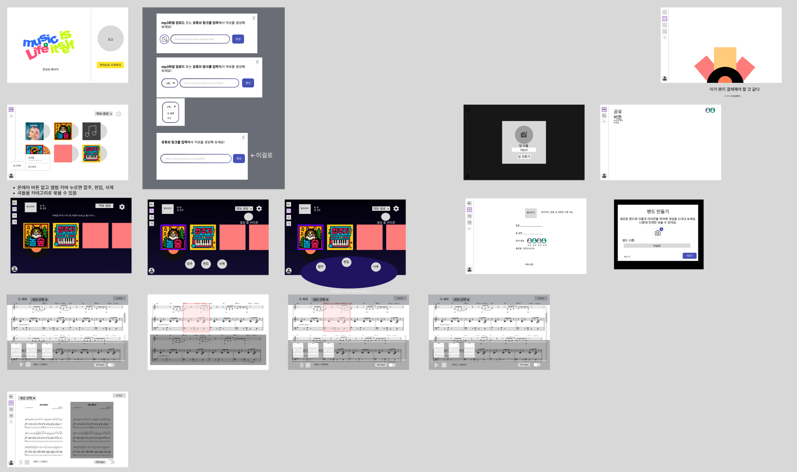
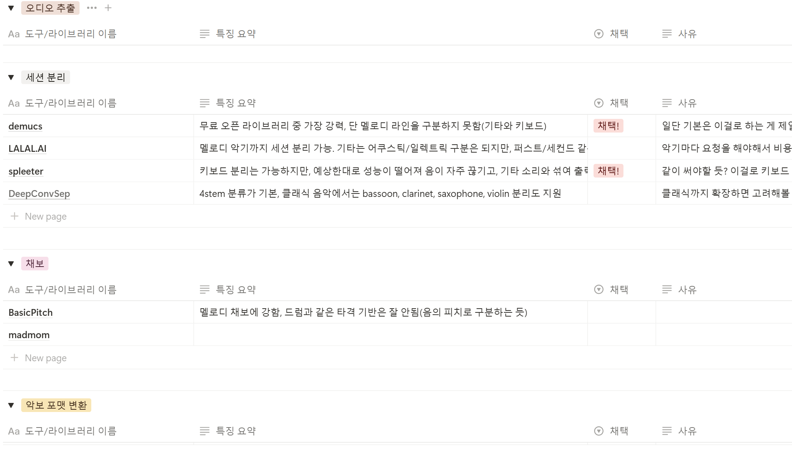

## 2025.04.24 목
**화면 기획서**

어제에 이어서 화면 기획을 어느정도 완성했다. 주요 기능인 악보 생성과 팀스페이스에서의 합주를 중심으로 화면을 구성했다. 화면을 구성하면서 몇 가지 논의 사항이 나왔는데 그에 대해 의견을 나눌 필요가 있을 것 같다. 

추가로 설문을 진행하기로 결정하였다. 우리 서비스의 필요성이나 유용함을 어필하기 좋을 것이라 판단하였다.

**기술 스택 검증 진행 중**

이어서 기술에 대해서 계속해서 검증을 시도해보고 있다. Demucs로 음원을 세션별로 분리하는 데 성공했지만 기타와 키보드 같은 멜로디 라인 세션이 other.wav로 묶여 나오는 문제가 있어서 이를 다시 분리하는 후처리가 필요한 상황이다. 6stem으로 분리해주는 옵션도 있지만 결과물이 마음에 들지 않았다. 음원 분리 및 midi 파일로 변환 하는 것은 조금 더 연구가 필요할 듯 하다. 
