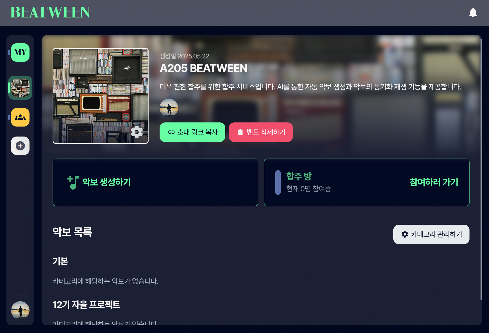
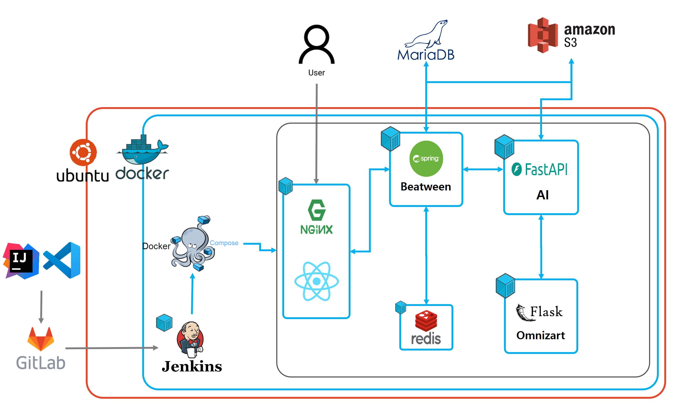

# 🎵 Beatween

**AI 악보 생성 및 실시간 밴드 합주 서비스**

> 유튜브 링크 하나로 밴드 합주까지!  
> AI가 자동으로 악보를 생성하고, 팀원들과 실시간으로 함께 연주하세요.

---

## 📌 서비스 소개

**Beatween**은 음원을 기반으로 악보를 자동 생성하고, 이를 바탕으로 밴드 팀원들과 실시간으로 합주할 수 있는 웹 서비스입니다.

### 🥁 주요 기능

1. **AI 기반 악보 자동 생성**

   - 유튜브 링크를 입력하면 자동으로 악보 생성
   - 드럼, 베이스, 기타, 피아노 등 세션 분리 및 개별 악보 제공

2. **전체 세션 악보 싱크**

   - 재생 시간에 따라 자동 하이라이팅 및 페이지 넘김
   - 모든 악기 세션 동기화 재생

3. **팀 스페이스**

- 팀원 초대 및 팀별 악보 관리
- 악보를 선택하여 합주 기능 지원

4. **퍼스널 스페이스**
   - 개인 악보 저장 및 관리
   - 혼자 연습 모드 제공

---

## 🛠 기술 스택

### 💻 Front-End

- React
- Tailwind CSS

### 🔧 Back-End

- Spring Boot (Java)
- FastAPI, Flask (Python)

### 🗃 Database

- MariaDB

### 🧠 AI/ML

- Python, NumPy, PyTorch, Tensorflow
- FastAPI, Flask

### ☁ Infrastructure

- Docker, Jenkins
- AWS S3, AWS OpenSearch

---

## 🧑‍💻 팀 구성 및 역할

| 이름   | 역할               |
| ------ | ------------------ |
| 백지민 | 팀장 / Full-Stack  |
| 서건호 | Front-End          |
| 이규리 | Full-Stack / Infra |
| 이성희 | Full-Stack         |
| 윤혜진 | AI / Back-End      |
| 최현용 | AI / Back-End      |

---

## 🧬 기술 특이사항

### 🎼 AI 악보 생성 파이프라인

- **demucs**: 유튜브 음원에서 악기별 음원 분리
- **BasicPitch / Omnizart**: 분리된 음원을 악보로 전사 (MIDI 변환)
- **MuseScore + musicxml**: MIDI → 악보 렌더링

### 🕸 실시간 합주 동기화

- WebSocket 기반 세션 동기화
- 악보 실시간 하이라이팅
- Redis를 통한 드로잉 동기화

### 🧠 AI 기술 활용

- **demucs**: 악기별 음원 분리
- **BasicPitch / Omnizart**: 악보 자동 채보
- **OpenAI GPT API**: 가사 자동 생성 및 자막(vtt) 변환

---

## 📄 문서 자료

- [요구사항 명세서](https://fallacious-antler-2d2.notion.site/1d58a774607d8196b8add120845fe2f5)
- [기획 (와이어프레임)](https://www.figma.com/design/aoe40Xe6rulhxdTTgqJgqE/A205-Beatween?node-id=0-1&t=IbEIGfqWjPW7xBOQ-1)
- [설계 (ERD)](https://www.notion.so/ERD-1e78a774607d8040bcfde7f764900046)
- [설계 (API 명세)](https://www.notion.so/API-1d58a774607d81029bb8eee83c9e8395)

---

## 🌐 서비스 링크

🔗 **[Beatween 바로가기](https://k12a205.p.ssafy.io/)**

---

## 🚀 배포 및 운영

- **CI/CD**: GitLab, Jenkins, Docker 기반 자동화
- **배포 환경**: AWS EC2, S3
- **외부 API**: OpenAI GPT API 활용

---

## 📢 기타

> 본 프로젝트는 SSAFY 자율 프로젝트 A205팀이 개발하였습니다.
