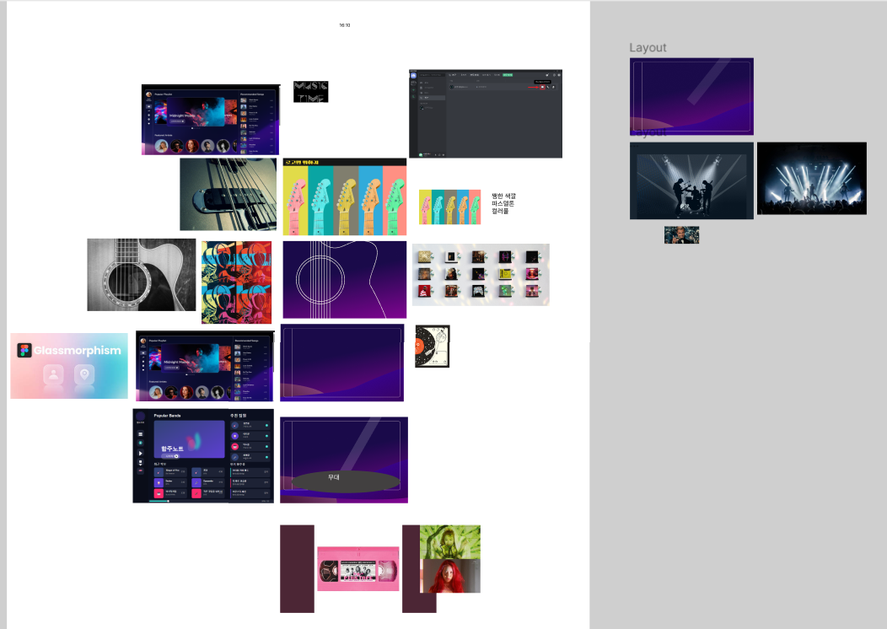

# 4/23 정리

# 1. 요구사항 명세서 & 간단한 기능 목업 작성

- 초기 메인 페이지 (현재는 디스코드/mm 형식의 UI로 바뀌면서 폐지)

- 디스코드/mm 형식의 메인 UI 화면
  
  - 네비게이션 형식은 depth가 너무 깊어질 우려가 있어 해당 UI 채택

- 악보 생성 버튼의 위치를 두고 논의한 결과
  
  - 마이페이지 = 개인 방이 따로 있다.
  
  - 악보는 방에서 생성하고 그 방과 수명주기를 함께한다.
  
  - 다른 방으로 악보를 공유할 수 있다.
  
  - 팀에서 생성한 악보를 저장하고 싶으면 개인 방으로 공유해야 한다.

- 팀에는 악보가 있고 그 악보를 읽고 편집할 수 있다.

- 편집 버튼의 위치에 관한 논의
  
  - 앨범에서도 가능 vs 곡 detail 페이지에서만 가능
  
  - 추후 결정 예정

- 악보는 스크롤이 가능하다.

- 전체 페이지를 A4형식으로 보고 "N번째 페이지를 보면~" 이라는 대화가 가능하게 페이지를 두고 이동할 수 있다.

- 합주 화면에 필요한 기능을 정리함

- 합주 화면에서 악보 확대/축소 기능이 필요하다. 그러나 우선순위는 낮다.

- 추가할 수 있는 기능들
  
  - 볼륨이 너무 커질 것 같아 전부 우선순위는 낮지만
  
  - 만약에!! 시간이 남는다면 일정공유, 개인연습, 커뮤니티 순으로 구현하기로 함

요구사항 명세서

| 카테고리      | 코드      | 기능          | 설명                                       | 우선순위   |
| --------- | ------- | ----------- | ---------------------------------------- | ------ |
| **회원**    | MEM-1   | 회원가입        | 카카오 회원가입                                 | 중간     |
|           | MEM-2   | 간편 로그인      | 카카오를 이용한 로그인                             | 중간     |
|           | MEM-3   | 로그아웃        | 카카오 OAUTH를 이용한 로그아웃                      | 중간     |
|           | MEM-4   | 회원탈퇴        | 서비스를 탈퇴할 수 있다.                           | 낮음     |
|           | MEM-5   | 프로필 화면      | 사용자 프로필을 확인할 수 있다.                       | 중간     |
|           | MEM-6   | 알림          | 악보 생성 완료 여부                              | **높음** |
| **소셜**    | BAND-1  | 밴드 그룹       | 밴드 방을 만든다                                | **높음** |
|           | BAND-2  | 밴드 그룹       | 밴드 방에 입장한 인원을 알 수 있다                     | **높음** |
|           | BAND-3  | 밴드 초대       | 만든 밴드 방에 초대 링크 공유 버튼이 있어서 복사할 수 있다       | **높음** |
|           | BAND-4  | 밴드 초대       | 만든 밴드 방에 공유 버튼으로 초대 링크를 다른 앱에 바로 보낼 수 있다 | 낮음     |
|           | BAND-5  | 밴드 삭제       | 방 생성한 사람이 방을 폭파할 수 있다                    | 중간     |
|           | BAND-6  | 밴드 퇴장       | 방에서 나갈 수 있다                              | 중간     |
| **악보 생성** | MCRE-1  | 곡 선택        | 유튜브 URL로 악보 생성                           | **높음** |
|           | MCRE-2  | 곡 선택        | 오디오 파일을 업로드해서 악보 생성                      | **높음** |
|           | MCRE-3  | 악보 생성(팀)    | 팀 페이지에서 악보 생성                            | **높음** |
|           | MCRE-4  | 악보 생성(개인)   | 개인 페이지에서 악보 생성                           | **높음** |
|           | MCRE-5  | 악보 공유(팀→개인) | 팀에서 사용하는 악보를 개인 페이지에 가져오기                | **높음** |
|           | MCRE-6  | 악보 공유(개인→팀) | 개인 페이지의 악보를 팀 페이지에 가져오기                  | **높음** |
|           | MCRE-7  | 악보 생성중      | 생성 중 로딩 표시 및 다른 페이지 이동 가능                | 낮음     |
|           | MCRE-8  | 악보 생성 완료    | 악보 생성 완료를 alert 창으로 알림                   | 중간     |
|           | MCRE-9  | 악보 생성 완료    | 악보 생성 완료를 알림 목록으로 알림                     | 중간     |
| **악보 삭제** | MDEL-1  | 악보 삭제       | 악보를 삭제한다.                                | 중간     |
| **악보 보기** | MDET-0  | 악보 선택       | 화면에 표시할 세션의 악보 선택                        | **높음** |
|           | MDET-1  | 악보 이동       | 스크롤로 악보 페이지 이동                           | **높음** |
|           | MDET-2  | 동시 페이지 전환   | 모든 멤버가 동일 타이밍에 페이지 자동 전환                 | **높음** |
|           | MDET-3  | 합주          | 시작 / 일시정지 / 재시작 / 정지                     | **높음** |
|           | MDET-4  | 합주 카운트      | 합주 시작 시 4초 카운트                           | **높음** |
|           | MDET-5  | 악보 연주       | 합주 BPM 선택 가능                             | **높음** |
|           | MDET-6  | 악보 메모       | 악보 화면에서 바로 메모                            | 낮음     |
|           | MDET-7  | 메트로놈        | 합주할 때 메트로놈 사용                            | 낮음     |
|           | MDET-8  | 악보 확대/축소    | 한 화면에 2~4줄 등 자유롭게 보기                     | 낮음     |
|           | MDET-9  | 구간 이동       | 특정 부분 터치 시 모든 멤버 이동                      | **높음** |
|           | MDET-10 | 페이지 바로가기    | 버거 메뉴로 페이지 탭 열어 바로 이동                    | 중간     |
|           | MDET-11 | 악보 전체화면     | 연주 시 일시정지 버튼만 남기고 나머지 숨김                 | **높음** |
|           | MDET-12 | 버튼 팝업       | 전체화면 터치 시 곡 제목·버튼 팝업                     | **높음** |
| **악보 편집** | MUPD-1  | 악보 편집       | 세션 악보 수정                                 | 중간     |
|           | MUPD-2  | 동시 편집 제한    | 같은 곡·세션 악보 동시 수정 불가                      | 중간     |
|           | MUPD-3  | 보기 편의       | 핀치/슬라이드로 확대·축소하며 수정                      | 낮음     |
| **일정 공유** | SCHE-1  | 일정 자동 맞추기   | 구글 캘린더 연동으로 공통 공백 일정 표시                  | 매우 낮음  |
| **자동 합주** | AUTO-1  | 자동 연주(팀)    | 빠진 사람의 연주를 자동으로 재생                       | 매우 낮음  |
|           | AUTO-2  | 자동 연주(개인)   | 개인 연습 시 나머지 세션 자동 연주                     | 매우 낮음  |
| **커뮤니티**  | COMM-1  | 커뮤니티 게시판    | 구인·홍보·공유·장소 구하기 게시판                      | 매우 낮음  |

- 팀 내에서 생각하는 기능과 작동방식, 구현방식이 일치하도록 회의

# 2. GUI 컨셉 작성

- 팝아트 형식 vs 검은색 배경에 조명이 있는 무대 컨셉
  
  - 후자 승

- 현재 피그마 작성중

- 정확한 컨셉이나 서비스명, 팀명은 결정하지 못함

현재 피그마 상황

- 컨셉 회의

- 메인 화면 구성중

