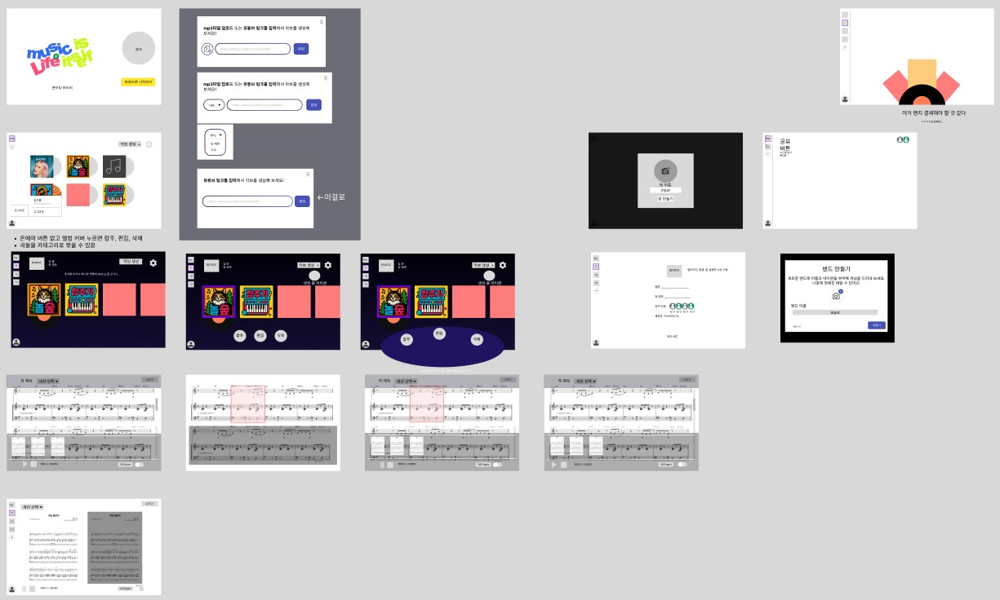

# 4/24 정리

# 1. 목업 제작

- 완성본

# 2. ppt 제작

[Dark Gradient Music Festival Presentation](https://www.canva.com/design/DAGlha5mhSM/nRfMbsJ5srpeUcfZPOySuA/view?utm_content=DAGlha5mhSM&utm_campaign=designshare&utm_medium=link2&utm_source=uniquelinks&utlId=he4bfd68f90)

# 3. 사용할 기술 조사

[Your connected workspace for wiki, docs &amp; projects | Notion](https://fallacious-antler-2d2.notion.site/1d58a774607d812b9afef491eefd3a23?v=1df8a774607d807a9d12000c7fc2451c)

- 오디오 추출 기술까지 조사 완료

- 세션분리, 채보, 악보 포맷 변환 등의 기술들은 1개 이상씩 사용할 수 있는 것만 확인

- 추가 조사 필요
